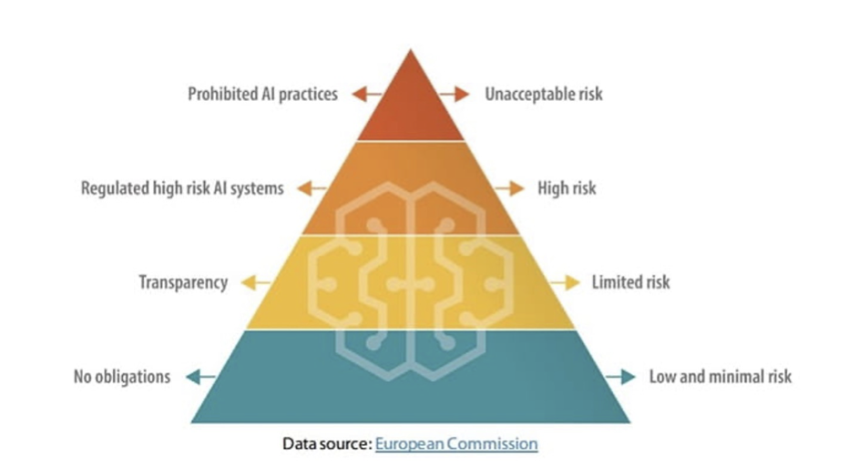

# 1. Introduzione: il regolamento in pillole
**di Giuseppe Vaciago**, Partner di 42 Law Firm.

L’Artificial Intelligence Act (noto come AI Act) è il primo atto normativo organico al mondo sull’Intelligenza Artificiale che mira a istituire un quadro giuridico uniforme volto a regolare lo sviluppo, la commercializzazione e l’uso dei sistemi di Intelligenza Artificiale in conformità con i valori e i diritti costituzionali dell’UE, limitando i rischi e prevenendo gli eventuali danni.

Si presume **entrerà in vigore tra la fine del 2023 e l’inizio del 2024** con i consueti due anni di attesa prima della sua concreta applicazione che quindi avverrà tra la fine del 2025 o l’inizio del 2026. Il percorso normativo è iniziato il 21 aprile 2021, con la proposta avanzata dalla Commissione Europea. A seguire, nel dicembre 2022 anche il Consiglio dell’Unione ha assunto la sua posizione su questo tema, e ha voluto specificare come una normativa che disciplini AI nasca dall’esigenza di assicurare che i sistemi di AI immessi all’interno del mercato dell’Unione europea siano sicuri e rispettino la normativa vigente in materia di diritti fondamentali e i valori dell’Unione_._ 

La proposta normativa si basa su un sistema di classificazione volto a determinare il livello di rischio che una tecnologia di AI potrebbe rappresentare per la salute, la sicurezza e i diritti fondamentali delle persone, cd. risk-based approach, differenziando tra gli usi dell'AI che creano: (i) un rischio inaccettabile; (ii) un rischio medio-basso; (iii) un rischio alto. A seconda del livello di rischio si prevedono più o meno elevati obblighi di conformità.

Per quanto concerne il **rischio inaccettabile**, viene individuato un elenco delle pratiche che comprende tutti i sistemi di AI il cui uso è contrario ai valori dell'Unione, ad esempio perché viola i diritti fondamentali. L'articolo 5 della Proposta di regolamento vieta, infatti, l'uso di tecniche subliminali, lo sfruttamento delle vulnerabilità di gruppi specifici, la valutazione discriminatoria delle persone e l'uso non autorizzato di identificazione biometrica in tempo reale. L'uso di identificazione biometrica richiede l’autorizzazione da un'Autorità indipendente.

**In linea generale** **per lo sviluppo ed uso di sistemi di Intelligenza Artificiale** responsabili ed etici sono stati individuati, all’articolo 4, **sei principi fondamentali**. Questi principi riguardano (i) la supervisione umana, (ii) la robustezza tecnica e la sicurezza, (iii) la privacy e la governance dei dati, (iv) la trasparenza, (v) la diversità, la non discriminazione e l'equità, ed infine (vi) il benessere sociale e ambientale. 

Vi sono poi **obblighi** che possono considerarsi trasversali, ovvero **destinati a particolari categorie di AI a prescindere dall’inquadramento del rischio** per tenere conto dei rischi specifici di manipolazione che essi comportano. L’intervento apportato dai relatori Benifei e Tudorache il 14 giugno 2023, è da considerarsi di particolare rilievo, in quanto ha introdotto un emendamento specifico relativo all’AI generativa, **come ChatGPT**, in forza del quale tali sistemi devono rispettare determinati obblighi. 

Oltre a quelli previsti dal recente emendamento vi sono determinati obblighi di trasparenza, che si applicheranno ai sistemi che: (i) interagiscono con gli esseri umani; (ii) sono utilizzati per rilevare emozioni o stabilire un'associazione con categorie (sociali) sulla base di dati biometrici; oppure (iii) generano o manipolano contenuti ("deep fake"). 

Infine, vi sono gli obblighi previsti esclusivamente per le **AI ad alto rischio**. Per comprendere come classificare un AI di alto rischio è necessario consultare gli allegati II e III alla Proposta. La scelta è stata quella di non prevedere una rigida definizione di cosa si intenda per AI ad alto rischio e demandare ad un apposito allegato, in quanto sarebbe stato rischioso un elenco tassativo considerata la rapidità con cui i sistemi di Intelligenza Artificiale si evolvono.

Rientrano, infatti, in questa categoria le AI che (i) sono destinate ad essere utilizzate come componente di sicurezza di un prodotto, o sono loro stesse un prodotto regolato dalle norme elencate nell’Allegato II e sono soggette a una valutazione della conformità da parte di terzi per l’immissione sul mercato ai sensi dalle normative dell'allegato II, oppure (ii) si tratta di sistemi di AI elencati all’interno dell'allegato III di cui la Commissione fornirà successivamente orientamenti. 

A seguito di un'analisi dell’AI Act è possibile sintetizzare **sette macrocategorie di obblighi**: (i) obblighi relativi alla gestione del rischio, (ii) obblighi relativi alla gestione dei dati, (iii) obblighi di trasparenza, (iv) obblighi di supervisione, (v) obblighi di conformità ai requisiti europei, (vi) obblighi di collaborazione con le Autorità e (vii) obblighi di accuratezza, cybersicurezza e resilienza.