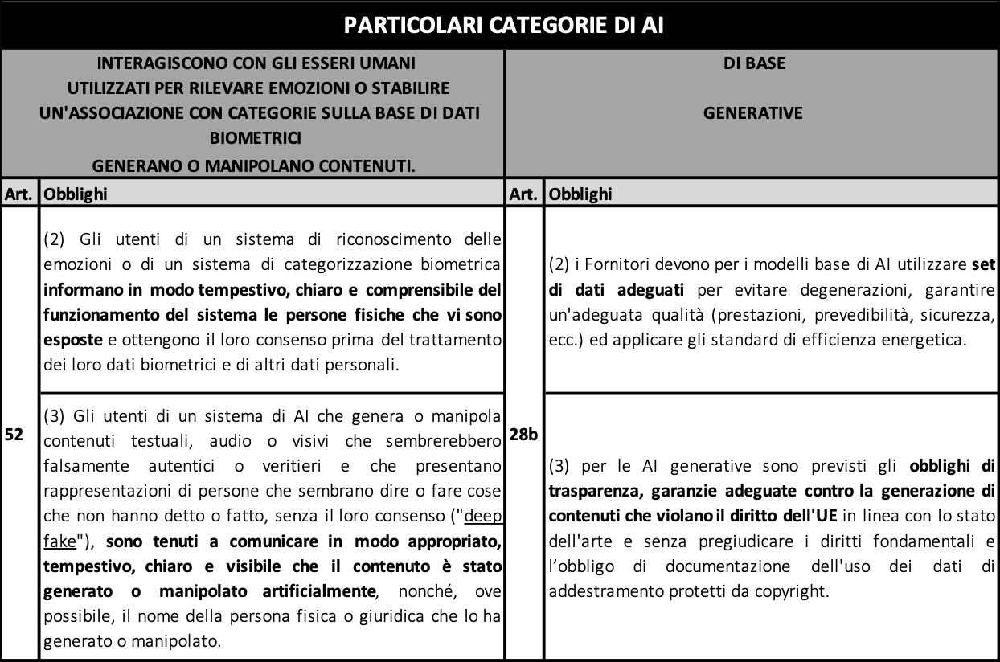

# 3. Obblighi per i modelli di base e trasversali

## 3.1 Obblighi per i modelli di base (GPT)

Il Parlamento europeo ha inserito nuovi obblighi per i Fornitori di modelli di base di AI ovvero quei sistemi di AI pre-addestrati che possono essere utilizzati a loro volta come base per lo sviluppo di altri sistemi di AI. 

Il nuovo articolo 28(b) tra le altre cose richiede ai Fornitori di queste particolari tecnologie di:

* utilizzare **set di dati adeguati** a evitare degenerazioni;
* garantire **un'adeguata qualità** (prestazioni, prevedibilità, sicurezza, ecc.); 
* applicare gli standard di **efficienza energetica**. 

La vera innovazione introdotta però sta nella disciplina delle c.d. AI generative ovvero quelle AI come ChatGPT che sono in grado di generare testo, immagini, video, musica o altri media in risposta a delle richieste fatte. Proprio in luce della particolarità di queste tecnologie viene previsto che:

* si rispettino gli obblighi di trasparenza;
* vengano previste garanzie adeguate **contro la generazione di contenuti che violano il diritto dell'UE** in linea con lo stato dell'arte e senza pregiudicare i diritti fondamentali;
* venga documentata pubblicamente una sintesi dell'uso dei dati di addestramento protetti da copyright (come si vedrà nel capitolo dedicato).

La particolarità di questa disposizione è che non si era mai arrivati a delineare così nel dettaglio obblighi per questo tipo di tecnologia. La stessa proposta in un primo momento non aveva considerato l’importanza e la delicatezza di prevedere obblighi ad hoc per un’AI ormai di grande utilizzo come ChatGPT. 

Questo permetterà un impiego diverso e più consapevole essendo stata contemplata la possibilità di richiedere ai fornitori di sistemi di AI generativa maggior trasparenza e moderazione dei contenuti.

## 3.2 Obblighi di trasparenza trasversali

**Fornitori**

I Fornitori di sistemi di che interagiscono con esseri umani devono: 

* informare in modo tempestivo, chiaro e comprensibile le persone che interagiscono con essi che ad interfacciarsi con loro è un’AI, a meno che ciò non sia già ovvio. 

**Utenti**

Gli Utenti di sistemi di riconoscimento delle emozioni o di categorizzazione biometrica devono:

* informare le persone esposte al sistema del trattamento dei loro dati biometrici e di altri dati personali; 
* ottenere il loro consenso. 

Gli Utenti di sistemi di AI che generano o manipolano contenuti c.d. "deep fake" devono:

* comunicare in modo appropriato e visibile che i contenuti sono stati generati o manipolati artificialmente;
* indicare il nome della persona fisica o giuridica che lo ha generato o manipolato. 

Le informazioni relative ai punti precedenti devono essere fornite alle persone fisiche al momento della prima interazione o esposizione. 

La trasparenza è un obbligo che ha un ruolo centrale nella normativa e riguarda tutti i trattamenti e i servizi basati sull’Intelligenza Artificiale, come dimostrato anche dai principi generali elencati all’interno dell’articolo 4. Anche per i sistemi che presentano un rischio limitato (come i deepfake) la Proposta di Regolamento non impone doveri particolari, ma prevede comunque limitati obblighi di trasparenza. 

Si tratta infatti di uno dei principi fondamentali non soltanto in tema di sviluppo di intelligenze artificiali, ma anche più in generale in tema di trattamento dei dati personali.

