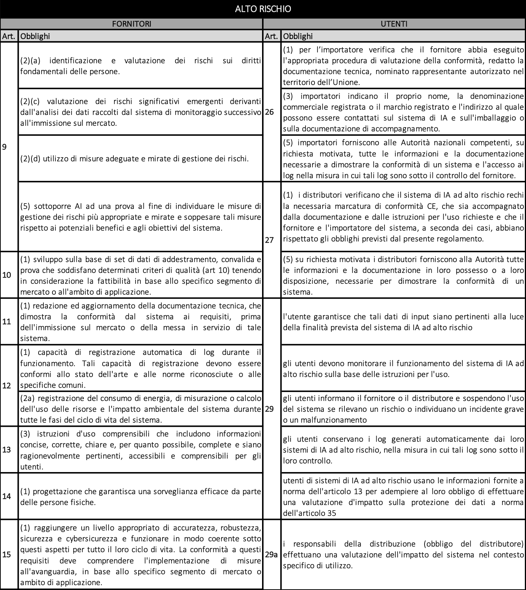
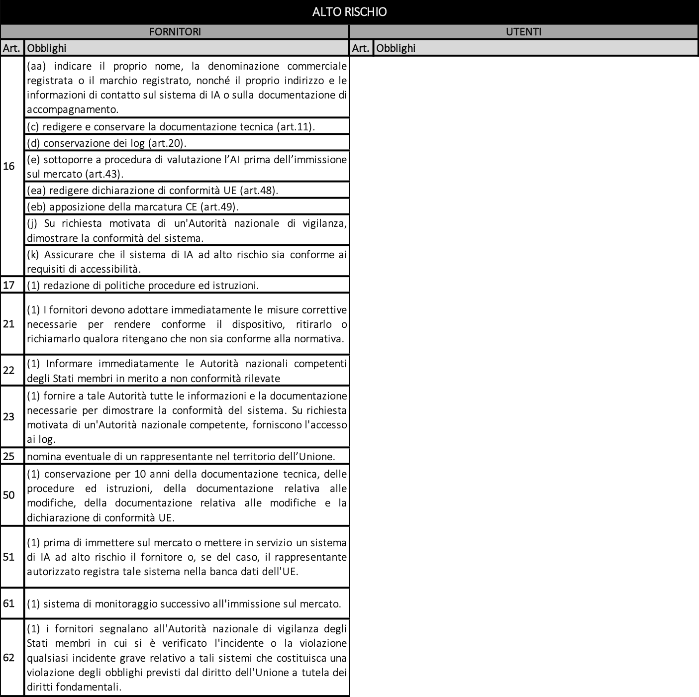

# 4. Obblighi specifici per sistemi ad alto rischio
**di Giuseppe Vaciago**, Partner di 42 Law Firm.

In questa sezione andremo ad analizzare gli obblighi specifichi che riguardano due distinte categorie. La prima è quella del fornitore e la seconda è quella dell’utente. L’articolo 3 del regolamento, come anticipato sopra, definisce queste due diverse categorie.

## 4.1 Obblighi relativi alla gestione del rischio

**Fornitori**

Il fornitore deve:

* **creare** un **sistema di gestione del rischio** per poter valutare e adottare misure di sicurezza consone;
* **testare il sistema** per individuare quelle che sono le misure di gestione più appropriate e mirate con l’obiettivo di: (i) garantire l’eliminazione o riduzione dei rischi individuati; (ii) attuare misure di mitigazione e controllo per affrontare i rischi che non possono essere eliminati e (iii) fornire istruzioni d’uso comprensibili;
* valutare, nell'attuare il sistema di gestione del rischio, se il sistema di AI ad alto rischio possa avere o meno un **impatto negativo su gruppi di persone vulnerabili o minori**, riesaminandolo ed aggiornandolo regolarmente per garantirne l’efficacia continua.

**Utenti**

Gli Utenti devono:

* preparare una **valutazione d’impatto sui diritti fondamentali** prima di mettere sul mercato un sistema di AI ad alto rischio. La valutazione deve includere una serie di elementi tra cui:
* lo scopo d’uso; 
* l’area geografica; 
* le categorie di persone che potrebbero essere danneggiate;
* la conformità alle norme sui diritti fondamentali;
* l’impatto ambientale;
* il piano dettagliato su come vanno mitigati i danni e l’impatto negativo sui diritti fondamentali.
* **notificare l’inizio della valutazione** alle Autorità nazionali e ai rappresentanti delle parti più deboli (come le associazioni dei consumatori, gli organismi per la parità, i sindacati e le agenzie per la protezione dei dati) al fine di considerare tutte le possibili ripercussioni della tecnologia sui soggetti più vulnerabili;
* **effettuare una valutazione d’impatto sulla protezione dei dati**, conformemente a quanto previsto dal GDPR, e quindi valutare i rischi che un determinato trattamento di dati personali può avere sulla protezione dei dati stessi. 

## 4.2 Obblighi relativi alla governance dei dati

**Fornitori**

I Fornitori devono indicare ogni tipo di informazione pertinente sul set di dati utilizzato, tenendo conto sia lo scopo previsto del sistema di AI, sia eventuali usi differenti - compresi quelli impropri - ragionevolmente prevedibili. Nello specifico, i dati utilizzati dai sistemi di AI ad alto rischio devono:

* essere soggetti ad una gestione adeguata che vada a disciplinare, conformemente allo scopo previsto dal sistema di AI, diversi aspetti a partire dalla **raccolta degli stessi** fino alla individuazione di misure appropriate per individuare, prevenire e attenuare eventuali distorsioni; 
* essere **pertinenti, rappresentativi, adeguati allo scopo** e la loro raccolta deve avvenire considerando lo specifico utilizzo del sistema di AI. 

I Fornitori possono **eccezionalmente** utilizzare dati personali sensibili **solo se necessario per individuare e correggere bias negativi** e solo se vengono rispettati determinati criteri tra cui: 

* la presenza di garanzie adeguate per i diritti e le libertà fondamentali;
* la pseudonimizzazione dei dati;
* l’adozione di misure tecniche e organizzative per garantire che i dati siano protetti e che solo le persone autorizzate vi abbiano accesso;
* la previsione della cancellazione una volta che l’errore viene corretto o il periodo di conservazione è scaduto;
* la redazione di una documentazione che spieghi perché il trattamento di categorie di dati personali sensibili era necessario.

**Utenti**

Anche gli utenti hanno l’obbligo di garantire che i dati di input siano **appropriati e sufficientemente rappresentativi** considerando la finalità prevista dal sistema di AI.

La gestione dei dati è fondamentale per prevenire la discriminazione e garantire l'uguaglianza, come dimostrano diversi casi di discriminazione di genere ed etnica posti in essere dai sistemi di AI negli ultimi anni. Queste problematiche sono state rese note a livello europeo per la prima volta con la pubblicazione del documento dell’UNESCO *I’d Blush If I Could* seguito poi da una serie di studi e linee guida anche a livello nazionale. È proprio per questi problemi che il testo sottolinea l'importanza di adottare accorgimenti adeguati nella gestione dei dati e nell'utilizzo dei sistemi di AI. Ciò garantirà che i sistemi di AI ad alto rischio siano correttamente addestrati su dati pertinenti, rappresentativi e adeguati e che i pregiudizi siano individuati e corretti in modo efficace e responsabile.

## 4.3 Obblighi specifici di trasparenza 

**Fornitori**

I Fornitori devono: 

* **redigere, conservare e aggiornare la documentazione tecnica** di tale sistema in modo da dimostrarne la conformità ai requisiti richiesti dalla presente Proposta prima di immettere sul mercato o mettere in servizio l’AI ad alto rischio;
* prevedere e conservare la **registrazione automatica dei log**, che devono contenere alcune informazioni minime, tra cui:
* data e ora di inizio di ogni utilizzo;
* data e ora di fine di ogni utilizzo;
* banca dati di riferimento;
* persone coinvolte nella verifica dei risultati.
* **fornire istruzioni** chiare, precise, corrette, oltre ad una serie di **informazioni** personali, quali: (i) il nome, (ii) la denominazione commerciale registrata o il marchio registrato, (iii) il proprio indirizzo, (iv) le informazioni di contatto.
* **informare** in modo chiaro, tempestivo e accessibile tutti i soggetti **di star comunicando con un sistema di AI.**

**Utenti**

Anche in capo agli Utenti è previsto un generale dovere di trasparenza che si articola in diversi obblighi:

* **conservare** per 6 mesi i **log di sistema** per controllarne il funzionamento, dimostrarne la conformità alla Proposta e per verificare ex post eventuali malfunzionamenti, incidenti o usi impropri del sistema;
* **informare le persone fisiche** che sono soggette all'uso di un sistema di AI nel caso vengano messi a disposizione sistemi ad alto rischio che prendono decisioni o contribuiscono a prendere decisioni relative a queste ultime.

Il requisito della trasparenza era già emerso in passato all’interno delle Ethics Guidelines for a Trustworthy AI_ _dell’High-Level Expert Group on Artificial Intelligence, nelle raccomandazioni dell’OECD e nelle linee guida redatte dalla stessa Microsoft nel 2018 quando si era parlato di indicare delle prime linee guida per lo sviluppo di AI. Come sopra evidenziato, all’interno di questa Proposta di Regolamento il rispetto del principio di trasparenza viene ripreso più volte sotto diversi aspetti. Tale analisi non soltanto ne sottolinea l’importanza ma evidenzia anche la sempre necessaria conformità con la normativa europea in tema di tutela del dato personale. Il Regolamento Generale sulla Protezione dei Dati (Reg. UE 2016/679), infatti, al fine di garantire la tutela dei diritti e delle libertà fondamentali delle persone fisiche in relazione al trattamento dei dati personali prevede che il trattamento dei dati personali debba essere effettuato in modo trasparente nei confronti degli interessati, che devono essere informati in modo completo, chiaro e conciso circa l'elaborazione dei loro dati personali.

## 4.4 Obbligo di supervisione

**Fornitori**

La Proposta di Regolamento stabilisce che, per i sistemi ad alto rischio, è necessaria una **supervisione umana** che deve essere:

* proporzionata ai rischi del sistema;
* effettuata attraverso soggetti preposti al controllo che (i) conoscono le capacità e i limiti dall’AI, (ii) siano in grado di monitorarne il funzionamento, (iii) siano capaci di intervenire o interrompere il sistema se necessario. 

L’obbligo di supervisione non è previsto solamente da un punto di vista generale, come appena affrontato, ma prevede **un ulteriore controllo per quei sistemi di AI ad alto rischio che prendono decisioni** attraverso una verifica e una conferma da almeno due persone fisiche competenti. I soggetti designati alla sorveglianza devono: 

* avere conoscenze sufficienti nell’ambito di questa tecnologia;
* avere l'autorità necessaria per esercitare tale funzione;
* essere specificamente informate del rischio di automazione o di bias di conferma.

**Utenti**

Anche gli Utenti hanno l’obbligo di sovrintendere ed agevolare la supervisione attraverso: 

* adeguati strumenti che permettano agli esseri umani di vigilare sul corretto funzionamento del sistema;
* l’individuazione di supervisori competenti, qualificati e che dispongano delle risorse necessarie per un’effettiva supervisione;
* l’adozione di misure tecniche e organizzative adeguate. 

Più nello specifico nella categoria degli Utenti all’interno della Proposta viene individuata la figura degli **Importatori** che devono:

* garantire la conformità dell’AI ad alto rischio prima di immetterla sul mercato;
* astenersi dall’immettere l’AI sul mercato qualora dovessero sorgere dubbi in relazione alla conformità del sistema.

Altra categoria specifica individuabile all’interno degli Utenti è quella dei **Distributori** ai quali viene fatto obbligo di:

* verificare la conformità dell’AI prima di immetterla sul mercato;
* astenersi dall'emettere l'AI sul mercato qualora dovessero sorgere dubbi in relazione alla conformità del sistema;
* garantire che, mentre un sistema di AI ad alto rischio è sotto la loro responsabilità, le condizioni di immagazzinamento o di trasporto non mettano a rischio la sua conformità. 

La mancata supervisione umana, soprattutto in ambito decisione è stata già rilevata in passato come elemento critico nell’utilizzo di AI. Nel 2018, Amazon ha dovuto interrompere l’utilizzo di un sistema di assunzione basato su algoritmi essendo stato rilevato come questo producesse risultati discriminatori nei confronti delle donne selezionando solamente curricula maschili. Il sistema era stato addestrato su una grande quantità di curriculum vitae inviati dagli aspiranti dipendenti negli anni precedenti che erano a maggioranza uomini, questo ha erroneamente fatto ritenere alla macchina che il curriculum di un uomo fosse preferibile rispetto a quello di una donna effettuando così una selezioni a priori. Un altro caso più recente ha, invece, riguardato l’utilizzo di AI da parte delle forze dell’ordine e come l’erronea decisione di quest’ultima abbia inciso su uno dei diritti fondamentali dell’uomo: la libertà. Nel 2019 il dipartimento di polizia di Detroit ha arrestato un uomo basandosi sull’analisi dei filmati fatta da una tecnologia di riconoscimento facciale che si è basata sulla foto della patente di guida. Il soggetto è stato trattenuto in custodia per 30 ore, prima di essere rilasciato avendo gli agenti di polizia riconosciuto l'errore. L'episodio è stato riportato dall'American Civil Liberties Union (ALCU), che ha presentato una denuncia contro il Dipartimento di Polizia di Detroit per violazione dei diritti civili. L'ACLU ha criticato l'uso dell'algoritmo di riconoscimento facciale come fonte unica di prove, poiché è stato dimostrato che il sistema può produrre risultati errati e discriminatori. L’obbligo di supervisione umana rappresenta, dunque, un importante meccanismo di controllo per garantire che le decisioni prese da sistemi di AI che possono avere un impatto significativo sulla vita delle persone siano giuste, etiche e conformi alle leggi e ai regolamenti applicabili. Si tratta di sistemi che possono imparare e adattarsi in modo autonomo, il che significa che la loro attività potrebbe diventare imprevedibile o incontrollabile senza una supervisione adeguata.

## 4.5 Obblighi di conformità ai requisiti europei

**Fornitori**

La Proposta dedica anche alcuni articoli all'individuazione di obblighi che potremmo inquadrare come obblighi di conformità ai requisiti europei. Viene richiesto infatti che il sistema di AI ad alto rischio: 

* sia sottoposto ad una procedura di valutazione della sua conformità, prima dell'immissione sul mercato o della messa in servizio;
* sia accompagnato da una dichiarazione di conformità;
* presenti la marcatura CE;
* sia conforme ai requisiti di accessibilità;
* venga registrato all’interno della banca dati dell’Unione;
* preveda la nomina di un rappresentante nel territorio dell’Unione se il Fornitore non ha sede all’interno dell’UE.

## 4.6 Obblighi di interazione e collaborazione con le Autorità

**Fornitori**

I Fornitori devono conservare per un periodo di 10 anni dall'immissione sul mercato o dalla messa in servizio del sistema di AI: 

* la documentazione tecnica;
* la documentazione relativa al sistema di gestione della qualità, ove applicabile;
* la documentazione relativa alle modifiche approvate dagli organismi notificati;
* le decisioni e gli altri documenti rilasciati dagli organismi notificati ed infine;
* la dichiarazione di conformità UE.

Viene infatti previsto che l'Autorità nazionale competente, con richiesta motivata, possa:

* domandare ai Fornitori/Installatori di AI di dimostrarne la conformità della tecnologia fornendo informazioni e documentazione della compliance agli obblighi individuati dalla Proposta di Regolamento;
* richiedere l'accesso ai log generati. 

L’Autorità non può divulgare i dati commerciali ottenuti e ha l’obbligo di trattarli con riservatezza. Le disposizioni in merito gli obblighi di interazione e collaborazione con le Autorità non si esauriscono con la messa a disposizione della documentazione, ma viene anche previsto che qualora il Fornitore rilevi:

* eventuali non conformità;
* un rischio che può potenzialmente influire negativamente su determinati aspetti della vita delle persone come la salute la sicurezza, i diritti fondamentali e la democrazia;
* un incidente grave; 

questi debba riportarli immediatamente alle Autorità di vigilanza nazionali, ai Distributori, agli Importatori ed agli Installatori e devono essere adottate misure correttive. In caso di incidenti gravi il termine per la comunicazione alle Autorità è di 72 ore.

**Utenti**

Gli Utenti compresi Fornitori, Importatori e Distributori, hanno sempre l'obbligo di: 

* collaborare con le Autorità nazionali competenti;
* informare le Autorità, il Fornitore, l’Importatore o il Distributori quando ritengono che l’uso dell’AI presenti un rischio a livello nazionale;
* informare le Autorità, il Fornitore, l’Importatore o il Distributori quando individuano un incidente grave o un malfunzionamento.

La normativa mira a garantire che i sistemi di AI ad alto rischio siano utilizzati in modo sicuro e che eventuali problemi siano individuati il prima possibile, per questo prevede una serie di obblighi di collaborazione con l’Autorità. Queste disposizioni sono atte ad accertare che i sistemi di AI ad alto rischio siano conformi ai requisiti di regolamentazione dell'UE e vengano utilizzati correttamente. 

## 4.7 Obblighi di accuratezza, robustezza, cybersicurezza e resilienza

**Fornitori**

L’accuratezza, robustezza, cybersicurezza e resilienza sono caratteristiche di estrema rilevanza in tema di nuove tecnologie e restano centrali anche all’interno della Proposta di regolamento in tema di AI. Per questa ragione è previsto che i Fornitori debbano **istituire un sistema di monitoraggio** post-vendita che: 

* raccolga, documenti e analizzi attivamente i dati pertinenti per tutta la durata di vita del prodotto;
* sia integrato nella documentazione tecnica;
* sia proporzionato alla natura delle tecnologie e ai rischi del sistema. 

L’obiettivo è permettere ai Fornitori di valutare la conformità dei sistemi di AI ai requisiti previsti dalla normativa. 

**Utenti**

Come molti degli obblighi finora visti, anche quello di accuratezza, robustezza, cibersicurezza e resilienza non riguarda esclusivamente i Fornitori ma anche gli Utenti. È infatti previsto che questi:

* garantiscano il monitoraggio adeguato;
* garantiscano l’aggiornamento delle misure di robustezza e cybersecurity. 

Di seguito una tabella riassuntiva degli obblighi dei fornitori e degli utenti nei sistemi ad alto rischio:

