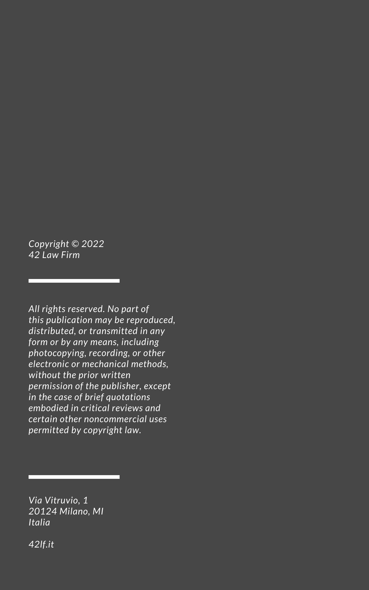

# 42 Law Firm

La prima legge di Moore presenta il seguente enunciato:

> “La complessità di un microcircuito, misurata ad esempio tramite il numero di transistor per chip, raddoppia ogni 18 mesi (e quadruplica quindi ogni 3 anni)”.

La costante applicazione della legge di Moore ha reso il terzo millennio tecnologico, interconnesso tra nuove opportunità e inedite difficoltà cambiando inesorabilmente il concetto della professione legale così come concepito nel secolo scorso.
42 Law Firm è una società composta da avvocati, informatici ed esperti della digital transformation che assiste i suoi clienti grazie a professionisti in grado di colmare il divario tra diritto e tecnologia.  
Al suo interno convivono le migliori competenze in grado di stringere le maglie della Rete e trovare aiuto e soluzione per qualunque bisogno. Perché la qualità delle competenze non cambia, ma migliora, grazie alle interconnessioni e alle possibilità che la tecnologia stessa offre.

È così che l'innovazione tecnologica e il diritto, insieme, diventano un connubio formidabile per un nuovo tipo di assistenza legale per affrontare meglio anche nuove realtà che la costante corsa al futuro scopre ogni giorno, in ogni ambito dell'economia e della persona.

42 come “La Risposta”, secondo Douglas Adams e la sua Guida Galattica per Autostoppisti, alla “Vita, l'universo e tutto quanto”.  
In 42 Law Firm ci accontentiamo di trovare **quella ai vostri problemi di Legal & Tech**.  
  
*Per maggiori informazioni:*  
**42 Law Firm srl - Società tra Avvocati**  
https://42lf.it  
info@42lf.it

